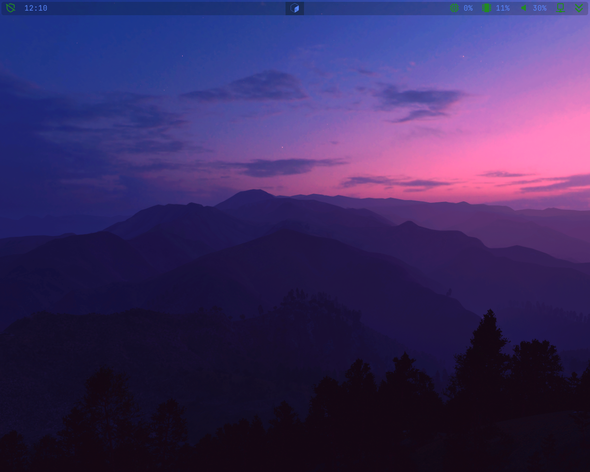
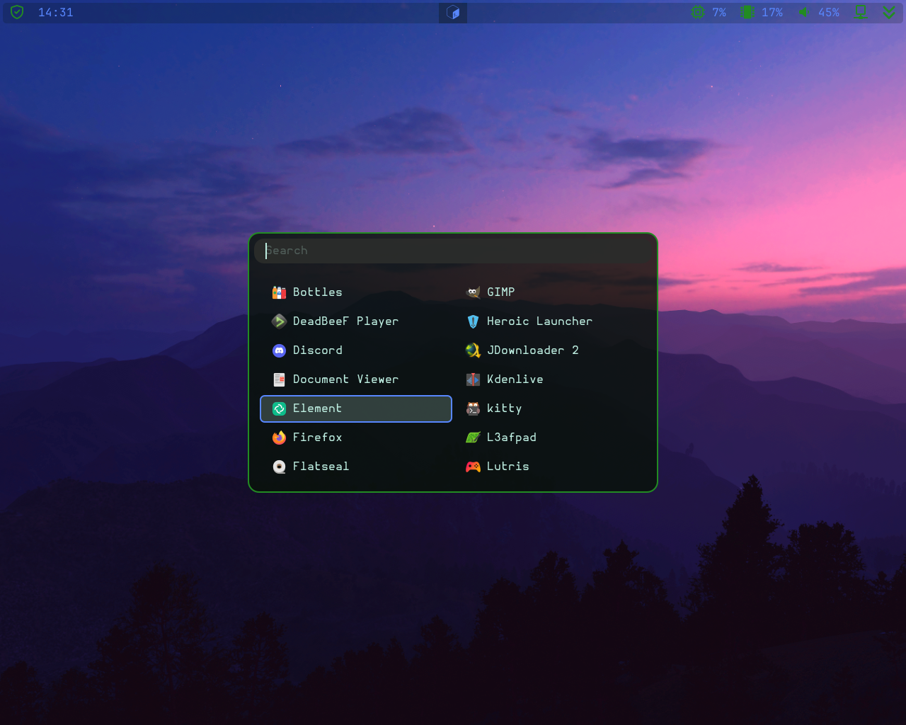
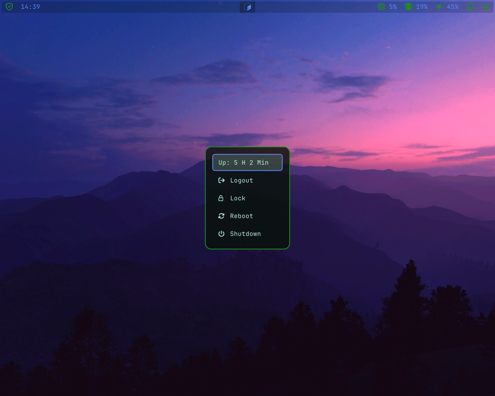
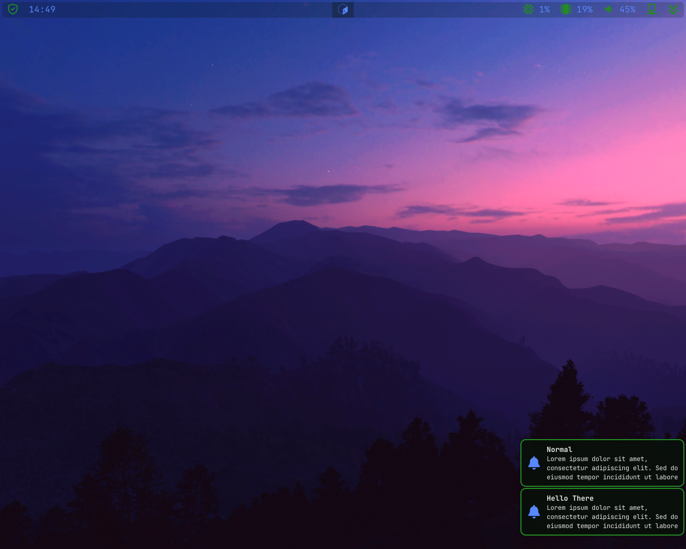
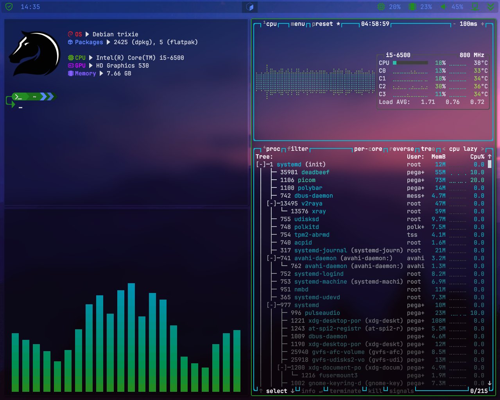

<h1 align="center">> My / dotfiles <</h1>

Welcome to my personal dotfiles repository! Here you’ll find my carefully curated configurations and scripts for a sleek Debian/sid environment. Feel free to explore, adapt, and integrate these dotfiles into your own setup. Instead of mirroring my entire configuration, I recommend cherry-picking the components that best suit your workflow.

In the near future, I plan to streamline the setup process with an installation script. For now, you’ll need to piece together the components yourself, but I hope you find the individual pieces useful in creating a setup that’s uniquely yours.

[Screenshots](#screenshots) are somewhere down there.

## Software Stack

Here’s a rundown of the tools and applications that power my environment

| **Type**            | **Name**                                                                                        |
| :------------------ | :---------------------------------------------------------------------------------------------: |
| Window Manager      | [i3](https://i3wm.org/)                                                                         |
| Status Bar          | [polybar](https://github.com/polybar/polybar)                                                   |
| System Tray         | [stalonetray](https://github.com/kolbusa/stalonetray)                                           |
| Notification Deamon | [dunst](https://github.com/dunst-project/dunst)                                                 |
| Lockscreen          | [betterlockscreen](https://github.com/betterlockscreen/betterlockscreen)                        |
| System Info Tool    | [fastfetch](https://github.com//neofetch)   [btop](https:stocratos/btop)                    |
| Terminal            | [kitty](https://github.com/kovidgoyal/kitty)                                                    |
| Promt Theme Engine  | [starship](https://github.com/starship/starship)                                                |
| Display Manager     | [ly](https://github.com/fairyglade/ly)                                                          |
| App Launcher        | [rofi](https://github.com/davatorium/rofi)                                                      |
| Web Browser         | [Firefox (with BetterFox)](https://github.com/yokoffing/BetterFox)                              |
| File Manager        | [lf](https://github.com/gokcehan/lf)   [thunar](https://docs.xfce.org/xfce/thunar/start)    |
| Code Editor         | [neovim](https://github.com/neovim/neovim)   [VSCodium](https://github.com/VSCodium/vscodium) |
| Image Viewer        | [qimgv](https://github.com/easymodo/qimgv)                                                      |
| Video Player        | [mpv](https://github.com/mpv-player/mpv)                                                        |
| Music Player        | [cmux](https://github.com/cmus/cmus)                                                            |
| PDF Reader          | [Evince](https://apps.gnome.org/Evince/)                                                        |
| GTK Theme           | [Qogir-Dark](https://github.com/vinceliuice/Qogir-theme)                                        |
| Icon Theme          | [Papirus](https://github.com/PapirusDevelopmentTeam/papirus-icon-theme)                         |
| Cursor Theme        | [Borealis](https://github.com/alvatip/Borealis-cursors)                                         |
| Fonts               | Nerd Fonts   [JetBrains Mono](https://www.programmingfonts.org/#jetbrainsmono)   [Hurmit](https://www.programmingfonts.org/#hermit) |

## Screenshots

<b><code>expand</code></b>
 

